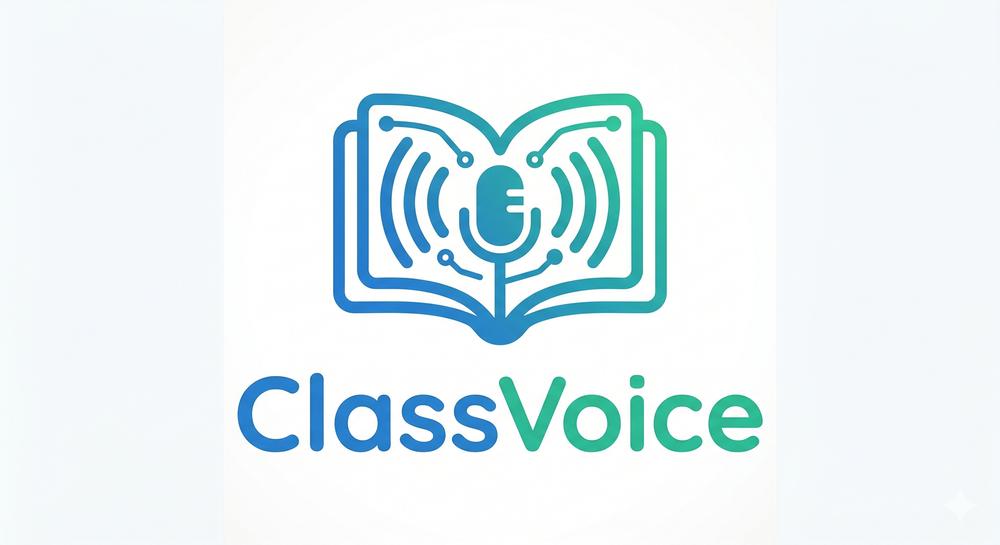
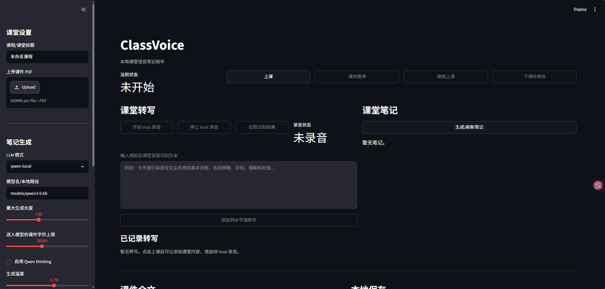

# ClassVoice

<p align="center">
  
</p>

ClassVoice 是一个本地课堂语音笔记助手，用于“语音交互”课程项目 Demo。它提供上课、课间暂停、继续上课、下课保存等课堂流程，支持 Vosk 本地语音识别、PDF 课件文本抽取、Qwen3-0.6B 本地笔记生成，以及面向用户自定义优化的 QLoRA 微调数据接口。

## 功能

- Streamlit 本地网页 UI
- 课堂状态管理：上课、暂停、继续、下课保存
- Vosk 本地离线语音识别
- 手动输入和修正课堂转写
- PDF 课件全文抽取
- Qwen3-0.6B 本地结构化课堂笔记生成
- QLoRA 微调数据采集接口
- 自动保存每节课的 Markdown 和 JSON 记录

## 界面预览

<p align="center">
  
</p>

## 项目结构

```text
ClassVoice/
  app.py
  classvoice/
    finetune_data.py
    llm.py
    pdf_utils.py
    session_store.py
    speech.py
  scripts/
    download_qwen_model.py
    download_vosk_model.py
    test_vosk_microphone.py
    train_qlora.py
  requirements.txt
  requirements-llm.txt
  requirements-modelscope.txt
  requirements-finetune.txt
```

运行时会生成：

```text
data/sessions/      # 课堂记录
data/finetune/      # QLoRA 训练数据
models/             # Vosk/Qwen 模型权重
outputs/            # 微调输出
```

## 环境准备

推荐使用 Conda：

```powershell
conda create -n classvoice python=3.10 -y
conda activate classvoice
pip install -r requirements.txt
```

如果要使用 Qwen 本地生成笔记：

```powershell
pip install -r requirements-llm.txt
```

如果使用 NVIDIA GPU，建议安装 CUDA 版 PyTorch：

```powershell
pip install --force-reinstall torch==2.9.1 --index-url https://download.pytorch.org/whl/cu128
```

检查 GPU：

```powershell
python -c "import torch; print(torch.cuda.is_available()); print(torch.cuda.get_device_name(0))"
```

## 下载模型

模型权重体积较大，不包含在 Git 仓库中，请用户自行下载。

### 下载 Vosk 中文小模型

```powershell
conda activate classvoice
python scripts/download_vosk_model.py
```

默认下载并解压到：

```text
models/vosk-model-small-cn-0.22
```

### 从魔搭下载 Qwen3-0.6B

```powershell
conda activate classvoice
pip install -r requirements-modelscope.txt
python scripts/download_qwen_model.py
```

默认下载到：

```text
models/qwen3-0.6b
```

## 运行

```powershell
conda activate classvoice
streamlit run app.py
```

打开浏览器访问：

```text
http://localhost:8501
```

关闭服务：回到运行 Streamlit 的终端，按 `Ctrl + C`。

## Demo 流程

1. 上传课程 PDF，点击“解析课件”。
2. 点击“上课”。
3. 点击“开始 Vosk 录音”，或手动输入课堂转写。
4. 点击“生成/刷新笔记”。
5. 点击“课间暂停”，再点击“继续上课”。
6. 点击“下课并保存”，在 `data/sessions/` 中查看 Markdown/JSON 课堂记录。

## QLoRA 微调接口

页面底部提供“QLoRA 微调数据接口”。用户可以上传：

- 网课视频：`mp4`、`mov`、`mkv`
- 音频文件：`mp3`、`wav`、`m4a`、`aac`
- 文本文件：`txt`、`md`
- 对应的人工高质量课堂笔记

点击“追加为 QLoRA 训练样本”后，系统会生成：

```text
data/finetune/qlora_notes.jsonl
data/finetune/uploads/
```

训练集格式采用 chat messages：

```json
{
  "messages": [
    {"role": "system", "content": "你是一个课堂语音笔记助手..."},
    {"role": "user", "content": "请根据以下网课材料生成结构化课堂笔记..."},
    {"role": "assistant", "content": "人工整理的标准课堂笔记..."}
  ]
}
```

安装微调依赖：

```powershell
pip install -r requirements-finetune.txt
```

运行 QLoRA 训练：

```powershell
python scripts/train_qlora.py --model-path models/qwen3-0.6b --dataset data/finetune/qlora_notes.jsonl
```

默认输出 LoRA adapter 到：

```text
outputs/qwen3-classvoice-qlora
```

说明：QLoRA 训练建议使用 NVIDIA GPU。Windows 环境下 `bitsandbytes` 兼容性可能随版本变化，若安装或训练失败，建议改用 WSL2/Linux 环境。

## Vosk 麦克风调试

如果页面中 Vosk 没有识别结果，先用命令行单独测试麦克风：

```powershell
conda activate classvoice
python scripts/test_vosk_microphone.py --device 1 --sample-rate 44100
```

如果 `peak` 很小，说明没有采集到声音，需要换输入设备或检查系统麦克风权限。页面侧边栏也提供“测试麦克风音量”功能。

## 注意事项

- `models/` 不提交 Git，请用户自行下载模型。
- 图片型 PDF 暂未做 OCR，当前只抽取 PDF 中可读取的文本。
- Qwen3-0.6B 首次加载会占用一定显存/内存；CPU 也能运行，但生成较慢。
